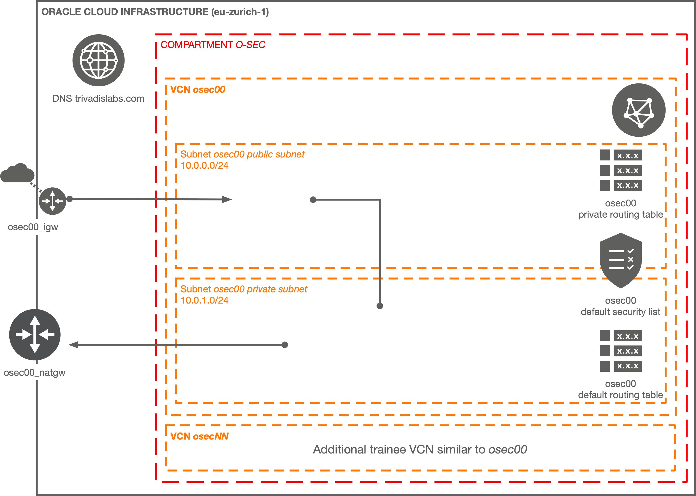

# Terraform Trivadis LAB VCN for Oracle Cloud Infrastructure

A reusable and extensible Terraform module that provisions a Trivadis LAB VCN on Oracle Cloud Infrastructure

It creates the following resources:

* A VCN with customizable CIDR block
* An optional internet gateway
* An optional NAT gateway
* An optional service gateway

The module can be parametrized by the number of participants. This will then create n-VCNs.

## Documentation

### Pre-requisites

tbd

### Instructions

tbd

## Related Documentation, Blog

- [Oracle Cloud Infrastructure Documentation](https://docs.cloud.oracle.com/iaas/Content/home.htm)
- [Terraform OCI Provider Documentation](https://www.terraform.io/docs/providers/oci/index.html)

## Projects using this module

tbd

## Changelog

View the [CHANGELOG](./CHANGELOG.md).

## Acknowledgement

Code derived and adapted from [oracle-terraform-modules/terraform-oci-vcn](https://github.com/oracle-terraform-modules/terraform-oci-vcn) and Hashicorp's [Terraform 0.12 examples][[terraform_oci_examples](https://github.com/terraform-providers/terraform-provider-oci/tree/master/examples)]

## Contributors

[Folks who contributed with explanations, code, feedback, ideas, testing etc.][contributors]

Learn how to [contribute][contributing].

## License

Copyright (c) 2019, 2020 Oracle and/or its associates. All rights reserved.

Licensed under the [Universal Permissive License 1.0][license] as shown at 
[https://oss.oracle.com/licenses/upl][canonical_license].